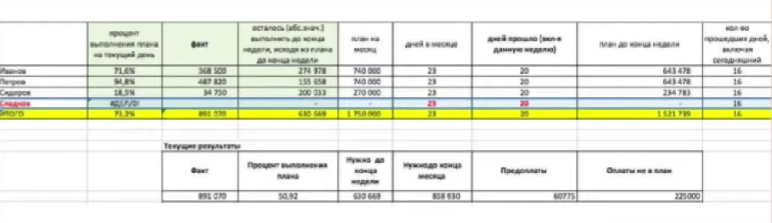

# MSR

**Зачем нужны отчёты?**

Контроль — ключевая цель отчетности.

Отслеживание работы сотрудников, степени выполнения планов и регулярных задач. Требуем от каждого менеджера персональный ежедневный отчет, следовательно, будем знать, чем занимается в течении рабочего дня сотрудник. Появляется дисциплина, максимальный КПД, быстро выявляются слабые и недобросовестные сотрудники.

Анализ — благодаря отчетам отслеживаются результаты новых введённых мер.

Изменение в продажах после проведенных мероприятий.

Обнаружение пробелов, ошибок в работе подразделения, а также их исправление.

Создание конкурентной среды среди продавцов.

Составление новых планов.

 

**Виды отчетов**

Доска.

Суть — на всеобщее обозрение выставляется доска с именами всех менеджеров по продажам и их достижениям.

Зеленая зона – безопасная, директор доволен.

Желтая зона – переходная.

Красная зона – результаты низкие.

 

Ежедневный отчет.

На самом деле в отделе продажа любой компании должны быть два основных отчета, без которых невозможно реализовать цели и задачи всей этой системы:

 • Воронка продаж — в табличном виде.

 • Активность менеджеров по периодам (вносятся не действия, а цифра сколько продал).

 

Планы.

Частью эффективной системы отчетности являются отчеты по планам, выставляемые сотрудникам. Учтите, что индивидуальный план — современный подход, а коллективная ответственность снижает общую мотивацию и скрывает «безбилетников», которые не прилагают усилий для продаж, но получают тот же процент от выручки.

 

Вывод.

Система отчетов и анализ продаж — это важный этап в работе компании и отдела по продажам.

Методы анализа продаж выявляют коммерчески успешные товары и помогают усилить слабые стороны, возникающие при работе.

Благодаря увеличению прибыли компания растет, а для этого нужно регулярно анализировать действия компании и совершенствовать стратегию продаж.
