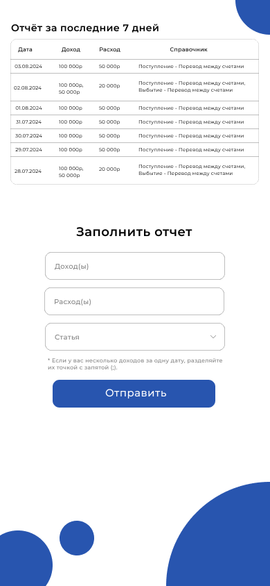

# Прототипирование системы

## Версии

Система включает две версии: desktop и mobile. Обе версии имеют два основных экрана: страницу авторизации и страницу заполнения отчетов с таблицей последних отчетов.

## Desktop версия

### Страница авторизации

На странице авторизации пользователи вводят свои учетные данные для доступа к системе.

### Страница заполнения отчетов

На этой странице пользователи могут вводить данные по доходам и расходам. Поля для ввода включают:

- **Доход**
- **Расход**
- **Статья**

Текущая дата автоматически ставится в соответствующее поле и не может быть изменена. В таблице отображаются последние отчеты, которые сортируются по дате.

## Mobile версия

### Страница авторизации

На странице авторизации пользователи вводят свои учетные данные для доступа к системе.

### Страница заполнения отчетов

На этой странице пользователи могут вводить данные по доходам и расходам. Поля для ввода включают:

- **Доход**
- **Расход**
- **Статья**

Текущая дата автоматически ставится в соответствующее поле и не может быть изменена. В таблице отображаются последние отчеты, которые сортируются по дате.

